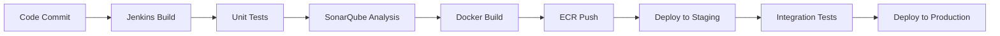

# Deployment

## Infrastructure

### Cloud Platform
- **Provider**: Amazon Web Services (AWS)
- **Compute**: Amazon ECS (Elastic Container Service)
- **Container Registry**: Amazon ECR (Elastic Container Registry)
- **Load Balancer**: Application Load Balancer (ALB)
- **Service Discovery**: AWS Cloud Map

### Database Infrastructure
- **Primary Database**: Amazon RDS for Oracle
- **Instance Type**: db.r5.xlarge (Production), db.t3.medium (Staging)
- **Multi-AZ**: Enabled for high availability
- **Backup**: Automated daily backups with 7-day retention
- **Read Replicas**: 2 read replicas for reporting workloads

### Network Architecture
```
Internet Gateway
       │
   ALB (Public)
       │
   ┌───▼───┐    ┌─────────┐    ┌─────────┐
   │ AZ-1a │    │  AZ-1b  │    │  AZ-1c  │
   │       │    │         │    │         │
   │ ECS   │    │  ECS    │    │  ECS    │
   │ Tasks │    │ Tasks   │    │ Tasks   │
   └───┬───┘    └────┬────┘    └────┬────┘
       │             │              │
   ┌───▼─────────────▼──────────────▼───┐
   │         RDS Oracle (Multi-AZ)      │
   └────────────────────────────────────┘
```

## Environments

### Development
- **Purpose**: Local development and feature testing
- **Infrastructure**: Developer workstations and shared dev database
- **Database**: Single Oracle instance (db.t3.micro)
- **Scaling**: Single instance
- **Monitoring**: Basic health checks only

**Configuration**:
```yaml
environment: development
database:
  url: jdbc:oracle:thin:@dev-db.internal:1521:XEPDB1
  maxSize: 8
server:
  applicationConnectors:
    - type: http
      port: 8080
logging:
  level: DEBUG
```

### Staging
- **Purpose**: Pre-production testing and integration validation
- **Infrastructure**: AWS ECS with 2 tasks across 2 AZs
- **Database**: RDS Oracle (db.t3.medium) with automated backups
- **Scaling**: Manual scaling, 2-4 tasks
- **Monitoring**: Full observability stack

**Configuration**:
```yaml
environment: staging
database:
  url: jdbc:oracle:thin:@staging-db.cluster-xyz.us-east-1.rds.amazonaws.com:1521:ORCL
  maxSize: 16
server:
  applicationConnectors:
    - type: http
      port: 8080
externalServices:
  authService:
    baseUrl: https://auth-service.staging.cvent.org
  passkeyInventoryService:
    baseUrl: https://passkey-inventory-service.staging.cvent.org
```

### Production
- **Purpose**: Live customer-facing environment
- **Infrastructure**: AWS ECS with auto-scaling (4-20 tasks)
- **Database**: RDS Oracle (db.r5.xlarge) Multi-AZ with read replicas
- **Scaling**: Auto-scaling based on CPU and memory metrics
- **Monitoring**: Comprehensive monitoring with alerting

**Configuration**:
```yaml
environment: production
database:
  url: jdbc:oracle:thin:@prod-db.cluster-abc.us-east-1.rds.amazonaws.com:1521:ORCL
  maxSize: 32
server:
  applicationConnectors:
    - type: http
      port: 8080
externalServices:
  authService:
    baseUrl: https://auth-service.prod.cvent.org
  passkeyInventoryService:
    baseUrl: https://passkey-inventory-service.prod.cvent.org
```

## CI/CD Pipeline

### Pipeline Overview
The deployment pipeline is implemented using Jenkins and follows GitOps principles:



### Jenkins Pipeline Stages

#### 1. Build Stage
```groovy
stage('Build') {
    steps {
        sh 'mvn clean compile'
    }
}
```

#### 2. Test Stage
```groovy
stage('Test') {
    parallel {
        stage('Unit Tests') {
            steps {
                sh 'mvn test'
            }
            post {
                always {
                    junit 'target/surefire-reports/*.xml'
                }
            }
        }
        stage('Integration Tests') {
            steps {
                sh 'mvn verify -Prun-it'
            }
        }
    }
}
```

#### 3. Quality Gate
```groovy
stage('Quality Gate') {
    steps {
        sh 'mvn sonar:sonar'
        script {
            def qg = waitForQualityGate()
            if (qg.status != 'OK') {
                error "Pipeline aborted due to quality gate failure: ${qg.status}"
            }
        }
    }
}
```

#### 4. Package Stage
```groovy
stage('Package') {
    steps {
        sh 'mvn package -Prelease -DskipTests'
        sh 'docker build -t passkey-reservation:${BUILD_NUMBER} .'
    }
}
```

#### 5. Deploy to Staging
```groovy
stage('Deploy to Staging') {
    steps {
        script {
            sh 'aws ecr get-login-password --region us-east-1 | docker login --username AWS --password-stdin ${ECR_REGISTRY}'
            sh 'docker tag passkey-reservation:${BUILD_NUMBER} ${ECR_REGISTRY}/passkey-reservation:${BUILD_NUMBER}'
            sh 'docker push ${ECR_REGISTRY}/passkey-reservation:${BUILD_NUMBER}'
            
            // Update ECS service
            sh 'aws ecs update-service --cluster staging --service passkey-reservation --force-new-deployment'
        }
    }
}
```

### Deployment Scripts

#### Docker Build Script (`build-it.sh`)
```bash
#!/bin/bash
set -e

echo "Building Passkey Reservation Service..."

# Build the application
mvn clean package -Prelease -DskipTests

# Build Docker image
docker build -t passkey-reservation:latest .

echo "Build completed successfully"
```

#### Release Script (`build-release.sh`)
```bash
#!/bin/bash
set -e

VERSION=${1:-$(date +%Y%m%d-%H%M%S)}
ECR_REGISTRY="123456789012.dkr.ecr.us-east-1.amazonaws.com"

echo "Creating release version: $VERSION"

# Build and tag
docker build -t passkey-reservation:$VERSION .
docker tag passkey-reservation:$VERSION $ECR_REGISTRY/passkey-reservation:$VERSION
docker tag passkey-reservation:$VERSION $ECR_REGISTRY/passkey-reservation:latest

# Push to ECR
aws ecr get-login-password --region us-east-1 | docker login --username AWS --password-stdin $ECR_REGISTRY
docker push $ECR_REGISTRY/passkey-reservation:$VERSION
docker push $ECR_REGISTRY/passkey-reservation:latest

echo "Release $VERSION pushed to ECR"
```

## Configuration Management

### Environment-Specific Configuration
Configuration is managed through environment-specific YAML files and environment variables:

#### Staging Configuration (`staging.yaml`)
```yaml
server:
  applicationConnectors:
    - type: http
      port: 8080
      bindHost: 0.0.0.0
  adminConnectors:
    - type: http
      port: 8081
      bindHost: 0.0.0.0

database:
  driverClass: oracle.jdbc.OracleDriver
  url: ${DATABASE_URL}
  user: ${DATABASE_USER}
  password: ${DATABASE_PASSWORD}
  maxSize: 16
  minSize: 4

logging:
  level: INFO
  appenders:
    - type: console
      threshold: ALL
      timeZone: UTC
```

#### Production Configuration (`production.yaml`)
```yaml
server:
  applicationConnectors:
    - type: http
      port: 8080
      bindHost: 0.0.0.0
  adminConnectors:
    - type: http
      port: 8081
      bindHost: 0.0.0.0

database:
  driverClass: oracle.jdbc.OracleDriver
  url: ${DATABASE_URL}
  user: ${DATABASE_USER}
  password: ${DATABASE_PASSWORD}
  maxSize: 32
  minSize: 8
  validationQuery: "SELECT 1 FROM DUAL"
  checkConnectionWhileIdle: true

logging:
  level: WARN
  loggers:
    com.cvent.passkey: INFO
  appenders:
    - type: console
      threshold: ALL
      timeZone: UTC
```

### Secret Management
Secrets are managed through AWS Systems Manager Parameter Store:

```bash
# Database credentials
aws ssm put-parameter --name "/passkey-reservation/prod/database/password" --value "secure-password" --type "SecureString"

# API keys
aws ssm put-parameter --name "/passkey-reservation/prod/auth-service/api-key" --value "auth-api-key" --type "SecureString"
```

### ECS Task Definition
```json
{
  "family": "passkey-reservation",
  "networkMode": "awsvpc",
  "requiresCompatibilities": ["FARGATE"],
  "cpu": "1024",
  "memory": "2048",
  "executionRoleArn": "arn:aws:iam::123456789012:role/ecsTaskExecutionRole",
  "taskRoleArn": "arn:aws:iam::123456789012:role/passkeyReservationTaskRole",
  "containerDefinitions": [
    {
      "name": "passkey-reservation",
      "image": "123456789012.dkr.ecr.us-east-1.amazonaws.com/passkey-reservation:latest",
      "portMappings": [
        {
          "containerPort": 8080,
          "protocol": "tcp"
        },
        {
          "containerPort": 8081,
          "protocol": "tcp"
        }
      ],
      "environment": [
        {
          "name": "ENVIRONMENT",
          "value": "production"
        }
      ],
      "secrets": [
        {
          "name": "DATABASE_PASSWORD",
          "valueFrom": "/passkey-reservation/prod/database/password"
        }
      ],
      "logConfiguration": {
        "logDriver": "awslogs",
        "options": {
          "awslogs-group": "/ecs/passkey-reservation",
          "awslogs-region": "us-east-1",
          "awslogs-stream-prefix": "ecs"
        }
      },
      "healthCheck": {
        "command": [
          "CMD-SHELL",
          "curl -f http://localhost:8081/healthcheck || exit 1"
        ],
        "interval": 30,
        "timeout": 5,
        "retries": 3,
        "startPeriod": 60
      }
    }
  ]
}
```

## Rollback Procedures

### Automated Rollback
ECS services support automated rollback on deployment failure:

```bash
# Enable circuit breaker for automatic rollback
aws ecs put-cluster-capacity-providers \
  --cluster production \
  --capacity-providers FARGATE \
  --default-capacity-provider-strategy capacityProvider=FARGATE,weight=1 \
  --deployment-configuration "deploymentCircuitBreaker={enable=true,rollback=true}"
```

### Manual Rollback
In case of issues, manual rollback can be performed:

```bash
# Get previous task definition
PREVIOUS_TASK_DEF=$(aws ecs describe-services \
  --cluster production \
  --services passkey-reservation \
  --query 'services[0].deployments[1].taskDefinition' \
  --output text)

# Rollback to previous version
aws ecs update-service \
  --cluster production \
  --service passkey-reservation \
  --task-definition $PREVIOUS_TASK_DEF
```

### Database Rollback
Database changes are managed through Flyway migrations:

```bash
# Rollback to specific version
mvn flyway:undo -Dflyway.target=1.2.5

# Validate database state
mvn flyway:validate
```

## Monitoring and Alerting

### CloudWatch Metrics
Key metrics monitored in production:

- **Application Metrics**:
  - Request rate (requests/minute)
  - Response time (P50, P95, P99)
  - Error rate (4xx, 5xx responses)
  - Active connections

- **Infrastructure Metrics**:
  - CPU utilization
  - Memory utilization
  - Network I/O
  - Disk I/O

### Datadog Integration
Custom application metrics sent to Datadog:

```java
@Component
public class ReservationMetrics {
    private final Counter reservationCreated = Counter.build()
        .name("reservations_created_total")
        .help("Total reservations created")
        .register();
        
    private final Histogram reservationProcessingTime = Histogram.build()
        .name("reservation_processing_seconds")
        .help("Time spent processing reservations")
        .register();
}
```

### Alerting Rules
Critical alerts configured in Datadog:

1. **High Error Rate**: Alert when error rate > 5% for 5 minutes
2. **High Response Time**: Alert when P95 > 2 seconds for 10 minutes
3. **Database Connection Issues**: Alert on connection pool exhaustion
4. **Service Unavailable**: Alert when health check fails for 3 consecutive checks

### Log Aggregation
Logs are centralized using AWS CloudWatch Logs:

```yaml
logging:
  appenders:
    - type: console
      threshold: ALL
      timeZone: UTC
      logFormat: |
        {
          "timestamp": "%d{ISO8601}",
          "level": "%level",
          "logger": "%logger{36}",
          "message": "%message",
          "correlationId": "%X{correlationId:-}",
          "userId": "%X{userId:-}",
          "requestId": "%X{requestId:-}"
        }
```

## Disaster Recovery

### Backup Strategy
- **Database Backups**: Automated daily backups with 30-day retention
- **Point-in-Time Recovery**: Available for last 35 days
- **Cross-Region Backup**: Weekly backups replicated to secondary region

### Recovery Procedures
1. **Service Recovery**: Deploy to secondary region using same ECS configuration
2. **Database Recovery**: Restore from backup or promote read replica
3. **DNS Failover**: Update Route 53 records to point to secondary region
4. **Data Synchronization**: Sync any data changes after recovery

### Recovery Time Objectives
- **RTO (Recovery Time Objective)**: 4 hours
- **RPO (Recovery Point Objective)**: 1 hour
- **Service Availability**: 99.9% uptime SLA